# RVEP 系統架構文件

> **RVEP (Remote Vehicle Edge Control Platform)** — 遠程車輛邊緣控制平台  
> 版本：v1.0.0-handoff | 日期：2026-06-04  
> 開發者：Shawn Huang @ Kefu Technology Ltd.

---

## 目錄

1. [系統概述](#1-系統概述)
2. [系統架構圖](#2-系統架構圖)
3. [使用案例圖](#3-使用案例圖)
   - 3.1 [操作員 Operator](#31-操作員-operator)
   - 3.2 [管理員 Admin](#32-管理員-admin)
   - 3.3 [觀察者 Viewer](#33-觀察者-viewer)
   - 3.4 [邊緣裝置 Edge Agent](#34-邊緣裝置-edge-agent)
   - 3.5 [車輛 ROS2 Vehicle](#35-車輛-ros2-vehicle)
4. [資料庫結構圖](#4-資料庫結構圖)
5. [通訊流程圖](#5-通訊流程圖)
6. [時序圖](#6-時序圖)
7. [介面規格總覽](#7-介面規格總覽)
8. [產生 Mermaid 圖片的步驟](#8-產生-mermaid-圖片的步驟)
9. [已知問題與注意事項 Known Issues](#9-已知問題與注意事項-known-issues)
   - 9.1 [架構正確性](#91-架構正確性)
   - 9.2 [安全性](#92-安全性)
   - 9.3 [監控與可觀測性](#93-監控與可觀測性)
   - 9.4 [測試覆蓋](#94-測試覆蓋)
   - 9.5 [文件與圖表](#95-文件與圖表)
   - 9.6 [NVENC 版本不匹配問題](#96-nvenc-版本不匹配問題)
   - 9.7 [權限與介面缺口](#97-權限與介面缺口)
   - 9.8 [註冊功能缺失](#98-註冊功能缺失)
   - 9.9 [Edge Publisher 無 LiveKit Token 更新機制](#99-edge-publisher-無-livekit-token-更新機制)
   - 9.10 [雙搖桿支援與 ROS2 Joy API 缺口](#910-雙搖桿支援與-ros2-joy-api-缺口)
   - 9.11 [mock-edge 僅使用虛擬資料，未讀取真實 ROS2 數值](#911-mock-edge-僅使用虛擬資料未讀取真實-ros2-數值)
   - 9.12 [相機發布重複實作](#912-相機發布重複實作)
10. [Room / Vehicle / Identity 命名規則](#10-room--vehicle--identity-命名規則)
   - 10.1 [Room Name](#101-room-name)
   - 10.2 [Vehicle ID](#102-vehicle-id)
   - 10.3 [LiveKit Participant Identity](#103-livekit-participant-identity)
   - 10.4 [Video Track Name](#104-video-track-name)
   - 10.5 [Unix Socket Path](#105-unix-socket-path)
   - 10.6 [環境變數](#106-環境變數)
   - 10.7 [Camera Profile YAML 欄位](#107-camera-profile-yaml-欄位)
11. [待解決問題優先度排名](#11-待解決問題優先度排名)

---

## 1. 系統概述

RVEP 是一個全端遠程車輛控制平台，專為工業 UGV、AMR 及四足機器人設計。系統採用 **LiveKit SFU** 作為即時通訊層，支援：

- **即時雙路 H.264 影像串流**（NVIDIA NVENC 硬體編碼）
- **Web 駕駛艙**：Telemetry HUD、Joystick 控制、緊急停止、三種駕駛模式
- **心跳安全機制**：1Hz 心跳 + 3 秒超時自動進入安全模式 + 人工恢復流程
- **AI 資料集存储**：三流架構（原始 + 標註 + JSONL 元數據）
- **車輛抽象層**：ROS2 cmd_vel 轉發、自定義適配器
- **車隊管理**：基於權限的存取控制

### 技術棧

| 層 | 技術 | 版本 |
|---|---|---|
| 後端 API | Next.js 15 + React 18 | ^15.0.0 |
| 資料庫 | PostgreSQL 16 + Prisma ORM | 16.4-alpine |
| 認證 | jose (JWT) + bcryptjs | ^5.9.0 |
| 即時通訊 | LiveKit SFU | v1.7.2 |
| Web 前端 | Next.js 15 + React 19 + Tailwind CSS v4 | ^4.0.0 |
| 狀態管理 | Zustand | ^5.0.13 |
| 邊緣代理 | TypeScript + @livekit/rtc-node | ^0.13.0 |
| 影片發佈 | Go 1.22 + GStreamer + NVENC | Go 1.22 |
| ROS2 橋接 | Python 3.12 + rclpy (ROS2 Jazzy) | 3.12 |
| 共享 Schema | Zod | ^3.23.0 |

---

## 2. 系統架構圖

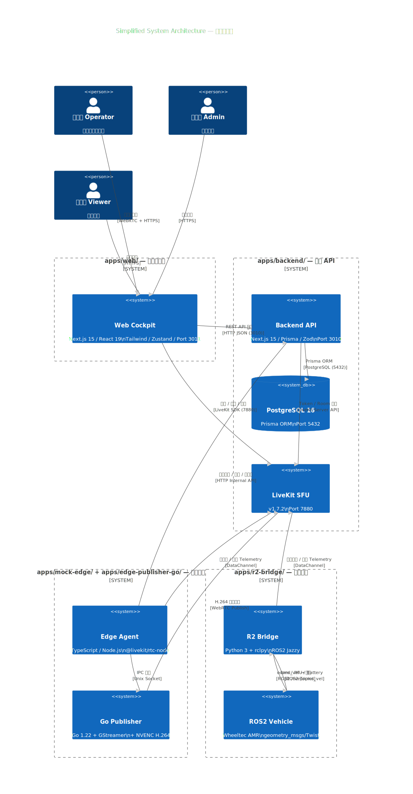

| 專案資料夾 | 角色 | 技術棧 | 連線對象 |
|-----------|------|--------|----------|
| `apps/web/` | Web Cockpit 前端 | Next.js 15 / React 19 / Tailwind / Zustand / Port 3011 | Operator → Cockpit → Backend API + LiveKit |
| `apps/backend/` | Backend API 伺服器 | Next.js 15 / Prisma ORM / PostgreSQL 16 / Port 3010 | API → PostgreSQL + LiveKit Server API |
| `apps/mock-edge/` | Edge Agent（邊緣代理） | TypeScript / Node.js / @livekit/rtc-node | Agent → LiveKit DataChannel + Backend Internal API |
| `apps/edge-publisher-go/` | Go Video Publisher | Go 1.22 / GStreamer + NVENC / Unix Socket IPC | Publisher → LiveKit; Agent ↔ Publisher IPC |
| `apps/r2-bridge/` | R2 Bridge（ROS2 橋接） | Python 3 / rclpy (ROS2 Jazzy) / LiveKit Python SDK | Bridge → LiveKit DataChannel + ROS2 Topics |

### 2.1 階層說明

| 階層 | 包含元件 | 職責 |
|------|----------|------|
| **Web 前端** | Operator Cockpit (Next.js 3011) + API Client (Zustand) | 駕駛艙 UI：Joystick / Telemetry HUD / Safety 警示 / 管理後台 |
| **後端雲服務** | Backend API (Next.js 3010) + PostgreSQL 16 + LiveKit SFU v1.7.2 | REST API 伺服器、資料持久化、WebRTC SFU 轉發 |
| **邊緣裝置** | Edge Agent (TypeScript) + Go Video Publisher (GStreamer+NVENC) | 相機擷取編碼、心跳安全邏輯、Telemetry 5Hz |
| **車輛層** | R2 Bridge (Python ROS2) + ROS2 Vehicle (Wheeltec AMR) | DataChannel → ROS2 命令轉譯、車輛回授 |
| **開發/測試** | Mock Edge Agent + @rvep/shared (Zod Schemas) | 無硬體模擬、共享 Schema 定義 |

### 2.2 連線說明

| 來源 | 目標 | 傳輸 | 內容 |
|------|------|------|------|
| 操作員 Operator | Web Cockpit | WebRTC + HTTPS | 操作駕駛艙：Joystick / HUD / STOP |
| 管理員 Admin | Web Cockpit | HTTPS | 管理後台：權限 / 稽核 / 資料集 |
| 管理員 Admin | LiveKit SFU | LiveKit Server API | 接管車輛（強制斷線） |
| 觀察者 Viewer | Web Cockpit | HTTPS | 唯讀監看 HUD |
| 觀察者 Viewer | LiveKit SFU | WebRTC Subscribe | 唯讀觀看影片串流 |
| Web Cockpit | Backend API | HTTP JSON (3010) | REST API 呼叫（登入/車輛/租約） |
| Web Cockpit | LiveKit SFU | LiveKit SDK (7880) | 發佈 ControlCommand + 心跳 / 接收 Video + Telemetry + Safety |
| Backend API | PostgreSQL | Prisma ORM (5432) | 讀寫 User / Vehicle / Lease / Log |
| Backend API | LiveKit SFU | LiveKit Server API | 發放 Token + 管理 Room |
| Go Publisher | LiveKit SFU | WebRTC Publish | H.264 NVENC 編碼 → Video Track |
| Edge Agent | LiveKit SFU | DataChannel | 接收 ControlCommand / 發佈 Telemetry + Safety |
| Edge Agent | Backend API | HTTP Internal | 回報取樣 Telemetry (1Hz) / ControlEvent / Dataset Asset |
| Edge Agent | Go Publisher | Unix Socket (JSON Lines) | IPC 管理：start / stop / heartbeat |
| R2 Bridge | LiveKit SFU | DataChannel | 訂閱 ControlCommand / 發佈 Telemetry + SafetyEvent |
| R2 Bridge | ROS2 Vehicle | ROS2 /rvep/cmd_vel | cmd_vel (Twist) 驅動馬達 |
| ROS2 Vehicle | R2 Bridge | ROS2 Topics | odom / IMU / Battery 回授 |
| Mock Edge | LiveKit SFU | LiveKit RTC Node SDK | 模擬 Video + DataChannel |
| Mock Edge | Backend API | HTTP Internal | Internal API 回報 |
| @rvep/shared | Cockpit/Agent/Backend/Mock | TypeScript import | 共享 ControlCommand / Telemetry / SafetyEvent Schema |

### 2.3 技術棧詳表

| 元件 | 框架/語言 | 版本 | 安裝方式 | 關鍵依賴 |
|------|-----------|------|----------|----------|
| Web Cockpit | Next.js 15 (TypeScript 5.x) | ^15.0.0 | `pnpm install` | React 19, Tailwind CSS v4, Zustand, @livekit/rtc-node, jose |
| Backend API | Next.js 15 App Router (TypeScript) | ^15.0.0 | `pnpm install` | Prisma v6, Zod, bcryptjs, jose, LiveKit Server SDK |
| PostgreSQL | PostgreSQL | 16.4-alpine | `docker compose up db` | — |
| LiveKit SFU | LiveKit Server (Go) | v1.7.2 | `docker compose up livekit` | — |
| Edge Agent | TypeScript / Node.js | ^22.0.0 | `pnpm install` | @livekit/rtc-node ^0.13.0 |
| Go Publisher | Go | 1.22 | `go build` | GStreamer, NVENC SDK |
| R2 Bridge | Python | 3.12 | `pip install -r requirements.txt` | rclpy (ROS2 Jazzy), numpy, LiveKit Python SDK |
| ROS2 Vehicle | ROS2 Jazzy (C++/Python) | Jazzy | ROS2 apt packages | geometry_msgs, nav_msgs, sensor_msgs |
| Mock Edge Agent | TypeScript / Node.js | ^22.0.0 | `pnpm install` | @livekit/rtc-node |
| Shared Schemas | TypeScript / Zod | workspace | `pnpm install` | Zod ^3.23.0 |

### 2.4 通訊協定對照

| 協定 | 用途 | 連接埠 | 加密 |
|------|------|--------|------|
| **HTTPS** | Web UI + REST API（登入/車輛/租約/稽核） | 3010 (API), 3011 (Cockpit) | TLS (dev: http) |
| **WebRTC** | H.264 影片串流 (SFU: LiveKit) | 7880 (SRTP/SCTP) | DTLS-SRTP |
| **DataChannel (SCTP)** | ControlCommand + Telemetry + SafetyEvent + Heartbeat | 7880 (over WebRTC) | DTLS-SRTP |
| **ROS2 Topics (DDS)** | cmd_vel / odom / IMU / Battery（車輛內部） | — (DDS discovery) | 無 (vehicle LAN) |
| **Unix Domain Socket** | Edge Agent ↔ Go Publisher IPC | — | 本機檔案系統 |
| **PostgreSQL Wire** | Prisma ORM → DB | 5432 (loopback) | 無 (dev) |
| **LiveKit Server API** | Token 發放 / Room 管理 | 7880 (HTTP) | 無 (dev) |
| **HTTP Internal API** | Edge Agent → Backend (telemetry/event/dataset) | 3010 | x-internal-token |

### 2.5 啟動方式

```bash
# 1. 資料庫 + LiveKit
docker compose up db livekit -d

# 2. 後端 API（含 API routes）
cd apps/backend && pnpm dev          # Port 3010

# 3. Web Cockpit（前端）
cd apps/cockpit && pnpm dev          # Port 3011

# 4. Edge Agent（需 LiveKit Token）
cd apps/mock-edge && pnpm dev

# 5. R2 Bridge（需 ROS2 + 車輛硬體）
cd apps/r2-bridge && python -m r2_bridge.main

# 6. Go Publisher（由 Edge Agent IPC 啟動）
cd apps/go-publisher && go build -o publisher .
```

### 2.6 專案結構

```
rvep-handoff/
├── apps/
│   ├── backend/          # Next.js 15 API Server (port 3010)
│   ├── cockpit/          # Next.js 15 Web Client (port 3011)
│   ├── mock-edge/        # Edge Agent 模擬器 (TypeScript)
│   ├── r2-bridge/        # ROS2 Bridge (Python)
│   └── go-publisher/     # Video Publisher (Go + GStreamer)
├── packages/
│   └── shared/           # Zod Schemas + 編解碼函式
├── docker-compose.yml    # PostgreSQL + LiveKit SFU
└── Mermaid/              # 系統架構圖檔
```

---

## 3. 使用案例圖


> **注意**：Mermaid v11 已移除 useCase 圖型，此處以 flowchart 替代呈現。

### 3.1 操作員 Operator


| 編號 | 名稱 | 簡述 |
|------|------|------|
| UC1 | 登入系統 Login | 輸入 Email/Password 取得 JWT |
| UC2 | 檢視車隊 View Fleet | 2 秒輪詢車輛狀態 |
| UC3 | 獲取控制權 Claim Lease | pg_advisory_xact_lock 取得獨佔租約 |
| UC4 | 操作車輛 Control Vehicle | Joystick → DataChannel → ROS2 cmd_vel |
| UC5 | 緊急停止 Emergency Stop | 96x96px 紅色 STOP + reliable publish |
| UC6 | 監看 Telemetry Monitor Telemetry | 5Hz TelemetryHUD 顯示 |
| UC7 | 心跳監控 Heartbeat Safety | 1Hz heartbeat, 3s timeout |
| UC8 | 安全模式恢復 Recover Safe Mode | RecoveryModal focus trap + 人工確認 |

### 3.2 管理員 Admin


| 編號 | 名稱 | 簡述 |
|------|------|------|
| UC1 | 登入系統 Login | 輸入 Email/Password 取得 JWT |
| UC2 | 檢視車隊 View Fleet | 全量車輛可見 |
| UC9 | 管理權限 Manage Permissions | Upsert 授權 + DELETE 撤銷 |
| UC10 | 審計日誌 View Audit Logs | GET /api/v1/audit (vehicleId/limit filter) |
| UC11 | 管理資料集 Manage Datasets | GET /api/v1/datasets 瀏覽 |
| UC12 | 接管控制 Takeover Control | POST takeover {newOperatorId, reason} |

### 3.3 觀察者 Viewer


| 編號 | 名稱 | 簡述 |
|------|------|------|
| UC1 | 登入系統 Login | 輸入 Email/Password 取得 JWT |
| UC2 | 檢視車隊 View Fleet | 唯讀車輛列表（無法進入駕駛艙） |
| UC6 | 監看 Telemetry Monitor Telemetry | 加入 LiveKit Room 觀看影片+HUD |

### 3.4 邊緣裝置 Edge Agent


| 編號 | 名稱 | 簡述 |
|------|------|------|
| UC7 | 心跳監控 Heartbeat Safety | 每 500ms 檢查 lastHeartbeatAt (3000ms timeout) |
| UC13 | 發佈影片串流 Publish Video | IPC 管理 Go Publisher + NVENC H.264 |
| UC14 | 發佈 Telemetry Publish Telemetry | 5Hz DataChannel + 1Hz DB sample |

### 3.5 車輛 ROS2 Vehicle


| 編號 | 名稱 | 簡述 |
|------|------|------|
| UC15 | 執行控制命令 Execute Control Cmd | DataChannel → R2 Bridge → geometry_msgs/Twist → /rvep/cmd_vel |

### 3.6 使用案例操作步驟說明

#### UC1 — 登入系統 (Login)

| 角色 | 操作步驟 |
|------|---------|
| **Operator** | 1. 開啟瀏覽器連線至 Web Cockpit (`http://localhost:3011/login`)<br>2. 輸入 Email + Password<br>3. 系統驗證 credentials → 回傳 JWT Access Token（1hr TTL, HS256）+ httpOnly Refresh Cookie（14天, SameSite=strict）<br>4. 若 5 次登入失敗 → 帳號鎖定 15 分鐘（鎖定期間再次嘗試仍傳回 423）<br>5. 鎖定期滿後再次失敗則從 1 重新計算 |
| **Admin** | 同上 |
| **Viewer** | 同上 |

#### UC2 — 檢視車隊 (View Fleet)

| 角色 | 操作步驟 |
|------|---------|
| **Operator** | 1. 登入成功後前端導向 `/vehicles` 車隊儀表板<br>2. 初始載入 `GET /api/v1/vehicles`（回傳 vehicleId / displayName / vehicleType / status）<br>3. 系統每 2 秒輪詢 `GET /api/v1/vehicles/{vehicleId}/status` 更新各車輛彙整狀態（租約 + Telemetry + online 判定）<br>4. 可匯出 CSV、按在線狀態排序<br>5. Admin 可看到所有車輛；Operator/Viewer 僅見有權限者 |
| **Admin** | 同上，但全量可見 |
| **Viewer** | 同上，唯讀（無法點擊進入駕駛艙） |

#### UC3 — 獲取控制權 (Claim Lease)

| 角色 | 操作步驟 |
|------|---------|
| **Operator** | 1. 在車隊儀表板點選車輛卡片 → 發送 `POST /vehicles/{vehicleId}/control-lease/claim`（需先建立 Session）<br>2. 後端檢查權限 → 以 `pg_advisory_xact_lock` + Serializable Transaction 建立 ControlLease（ACTIVE, 30min TTL）<br>3. 若已有其他 Operator 持有有效租約 → 回傳 409 `lease_taken`<br>4. 取得租約後 → `POST /livekit/token` 取得 LiveKit Room Token |

#### UC4 — 操作車輛 (Control Vehicle)

| 角色 | 操作步驟 |
|------|---------|
| **Operator** | 1. 取得 LiveKit Token → `room.connect(url, token)` 加入 LiveKit Room（自動訂閱 Video Track）<br>2. 接收 H.264 雙路影片串流，渲染於 `<video>` tiles，每幀計算 G2G 延遲<br>3. 拖曳 Joystick（forward/yaw 雙軸）或使用 Gamepad（Xbox/PS5 30Hz 輪詢）<br>4. Joystick 以 8Hz（125ms interval）輸出 `movement` Command，livekit `publishData(reliable=false)` → LiveKit SFU<br>5. R2 Bridge 透過 DataChannel 接收命令 → `decodeCommand()` → 調用 `adapter.publish_movement()` 發佈 ROS2 `/rvep/cmd_vel`<br>6. Edge Agent 亦收到命令但僅做安全阻擋檢查（safe_mode 時拒絕）<br>7. R2 Bridge 以 5Hz 發佈 Telemetry（velocity / odom / battery / imu），Cockpit TelemetryHUD 顯示 |

#### UC5 — 緊急停止 (Emergency Stop)

| 角色 | 操作步驟 |
|------|---------|
| **Operator** | 1. 點擊 Cockpit 中的紅色「✕ STOP」按鈕（96×96px 圓形，shadow glow）<br>2. `ControlChannel.sendEmergencyStop()` → `publishData(reliable=true)` 經 DataChannel<br>3. R2 Bridge 收到 `emergency_stop` → `adapter.publish_emergency_stop()`（停止所有馬達）+ 廣播 `emergency_stop_acked`<br>4. Edge Agent 收到 → `enterSafeMode("emergency_stop")` → 零速度 + 廣播 `safe_mode_entered`<br>5. 頁面隱藏時同步觸發（`usePageVisibilitySafeStop` hook，`sendEmergencyStopSync()` 同步寫入 WebRTC stack） |

#### UC6 — 監看 Telemetry (Monitor Telemetry)

| 角色 | 操作步驟 |
|------|---------|
| **Operator** | 1. 進入駕駛艙後 DataChannel `onData` callback 接收 Uint8Array Payload<br>2. Cockpit 以 `decodeTelemetry()` 解碼 → TelemetryHUD 顯示 GPS / Battery / Network RTT / Velocity / Odom / Vehicle Mode<br>3. 若 telemetry 停止 > 1.5s，HUD 降透明度標記為 stale<br>4. Edge Agent 以 5Hz 發佈 TelemetryMessage（含 GPS / IMU / Battery / Network / VehicleStatus）<br>5. R2 Bridge 亦以 5Hz 發佈 Telemetry（velocity / odom / battery / imu） |
| **Viewer** | 1. 登入後從車隊儀表板選擇車輛<br>2. 以 viewer role 取得 LiveKit Token → 加入 Room（唯讀權限）<br>3. 可觀看影片串流 + Telemetry HUD（無法操控，無 Joystick） |

#### UC7 — 心跳監控 (Heartbeat Safety)

| 角色 | 操作步驟 |
|------|---------|
| **Operator** | 1. `ControlChannel.startHeartbeat()` → 以 `setInterval(fn, 1000)` 每秒發送 `heartbeat` Command（`reliable=false`）<br>2. 若心跳訊號中斷 > 3 秒 → 車輛進入 Safe Mode<br>3. 需手動確認恢復（見 UC8） |
| **Edge Agent** | 1. `startHeartbeatWatcher()` 每 500ms 檢查 `lastHeartbeatAt` (monotonic ms)<br>2. `handleCommand("heartbeat")` 重置 `lastHeartbeatAt`<br>3. `lastHeartbeatAt === 0` 表示尚未收到任何心跳（boot 預設 safe_mode）<br>4. 超時 (`age > 3000ms`) → `enterSafeMode("heartbeat_timeout")` → 零速度 + 廣播 `safe_mode_entered` |
| **R2 Bridge** | 1. `Watchdog` class 獨立運作，每 500ms 檢查心跳新鮮度<br>2. `watchdog.beat()` 由 `heartbeat` Command 觸發<br>3. 超時 (`elapsed > HEARTBEAT_TIMEOUT_S=3.0`) → `trigger_stop()` → `adapter.publish_stop()` + 廣播 `safe_mode_entered` |

#### UC8 — 安全模式恢復 (Recover Safe Mode)

| 角色 | 操作步驟 |
|------|---------|
| **Operator** | 1. SafetyBanner 顯示「車輛處於安全模式」（amber tone）或「與車輛失去連線」（red tone）<br>2. RecoveryModal 全屏覆蓋（focus trap 確保 Tab 循環在 modal 內）<br>3. 確認周圍安全後點擊「我已準備好 — 恢復控制權」<br>4. Cockpit 發送 `resume_control`（`acknowledgement: "operator_confirmed"`, `reliable=true`）<br>5. Edge Agent 收到 → 檢查心跳新鮮度（`lastHeartbeatAt < 1000ms`）→ `leaveSafeMode()` → 廣播 `safe_mode_left`<br>6. 若心跳已過期（> 1s）→ Agent 拒絕恢復，等待下次心跳更新後重試 |

#### UC9 — 管理權限 (Manage Permissions)

| 角色 | 操作步驟 |
|------|---------|
| **Admin** | 1. 從車輛列表選擇車輛 → `GET /vehicles/{vehicleId}/permissions` 列出所有權限（含 userId / role / grantedBy / createdAt）<br>2. `POST /vehicles/{vehicleId}/permissions`（body: `{userId, role}`）授予或更新角色（upsert：ADMIN / OPERATOR / VIEWER）<br>3. `DELETE /vehicles/{vehicleId}/permissions/{userId}` 撤銷權限 |

#### UC10 — 審計日誌 (View Audit Logs)

| 角色 | 操作步驟 |
|------|---------|
| **Admin** | 1. 導航至 `/admin/audit` → `GET /api/v1/audit`（支援 `?vehicleId=` 與 `?limit=` query）<br>2. 查看 EventLog 列表（id / eventName / ts / userId / vehicleId / payload）<br>3. Admin 可查看所有車輛記錄；非 Admin 需指定 vehicleId 且有權限 |
| **Operator / Viewer** | `GET /api/v1/audit?vehicleId={vehicleId}` — 僅限有權限的車輛（scope required） |

#### UC11 — 管理資料集 (Manage Datasets)

| 角色 | 操作步驟 |
|------|---------|
| **Admin** | 1. 導航至 `/admin/datasets` → `GET /api/v1/datasets`（支援 `?vehicleId=` 與 `?limit=` query）<br>2. 瀏覽 DatasetAsset 列表（含 sessionId / sessionPurpose / kind / source / path / sizeBytes / sha256 / retentionTier）<br>3. 資料由 Edge Agent 於 Session 結束時透過 `POST /internal/dataset-asset` 註冊 |
| **Operator / Viewer** | `GET /api/v1/datasets?vehicleId={vehicleId}` — 僅限有權限的車輛 |

#### UC12 — 接管控制 (Takeover Control)

| 角色 | 操作步驟 |
|------|---------|
| **Admin** | 1. 選擇已被佔用的車輛<br>2. 發送 `POST /vehicles/{vehicleId}/control-lease/takeover`（body: `{newOperatorId, reason}`）<br>3. 後端將當前 Lease 設為 REVOKED（記錄 revokedAt）→ 為新操作員建立 ACTIVE Lease（30min TTL，需存在 Active Session）<br>4. 原 Operator 下次心跳時會發現 Lease 已被 Revoke |

#### UC13 — 發佈影片串流 (Publish Video)

| 角色 | 操作步驟 |
|------|---------|
| **Edge Agent** | 1. `new GoPublisherManager()` 初始化（執行程式化 Go binary）<br>2. Agent 連線至 LiveKit Room → Agent 發送 IPC `start`（含 LiveKit Token + Pipeline 配置）<br>3. Go Publisher 以 GStreamer + NVENC 硬體編碼 H.264 → 以 `publishDataTrack()` 發佈 Video Track 至 LiveKit Room<br>4. Agent 監聽 IPC `heartbeat`（1Hz，含 FPS / dropped frames），超時進行 exponential backoff 重連（1s→...→30s cap，max 10 次）

#### UC14 — 發佈 Telemetry (Publish Telemetry)

| 角色 | 操作步驟 |
|------|---------|
| **Edge Agent** | 1. `MockTelemetryPublisher` 啟動 → 以 `setInterval` 5Hz 發佈 TelemetryMessage（含 GPS/IMU/Battery/Network/VehicleStatus）至 LiveKit DataChannel<br>2. 每 5 個 frame 取樣一次（1Hz），`POST /internal/telemetry-frame` 寫入 DB<br>3. `MetadataWriter` 每秒寫入 JSONL → Session 結束時 `finalize()` → `POST /internal/dataset-asset` 註冊 data asset（含 path / size / sha256）

#### UC15 — 執行控制命令 (Execute Control Cmd)

| 角色 | 操作步驟 |
|------|---------|
| **ROS2 Vehicle** | 1. R2 Bridge（Python）的 `on_data` callback 從 DataChannel 收到 JSON payload<br>2. `json.loads()` 解析 → 依 `type` 分派：`movement` → `pub.publish_cmd(fwd, lat, yaw)` → `adapter.publish_movement()` → ROS2 `/rvep/cmd_vel`；`emergency_stop` → `pub.publish_stop()`（零速度 + `/rvep/emergency_stop`）<br>3. 若 `BRIDGE_PUBLISH_MODE=mirror`，同時發佈至 `/cmd_vel`（直接馬達控制，bypass twist_mux）<br>4. ROS2 Subscribers 回授：`/odom` → velocity + pose、`/robot/PowerValtage` → battery voltage、`/mobile_base/sensors/imu_data` → IMU<br>5. R2 Bridge 亦有獨立 `Watchdog`（3s timeout），超時時 `trigger_stop()`（心跳由 operator 1Hz heartbeat 餵養） |

---

## 4. 資料庫結構圖


### 4.1 實體說明

#### User — 使用者

| 欄位 | 類型 | 鍵 | 預設值 | 說明 |
|------|------|----|--------|------|
| id | String | PK | uuid() | UUID |
| email | String | UK | — | 登入信箱 (unique) |
| passwordHash | String | — | — | bcrypt 雜湊 |
| role | Enum | — | — | ADMIN / OPERATOR / VIEWER |
| createdAt | DateTime | — | now() | 註冊時間 |
| updatedAt | DateTime | — | updatedAt | 更新時間 |
| failedLoginCount | Int | — | 0 | 連續失敗次數 |
| lockedUntil | DateTime? | — | null | 鎖定截止時間 (null=未鎖定) |
| refreshTokenVersion | Int | — | 0 | Token 版號 (每換發+1) |

#### Vehicle — 車輛

| 欄位 | 類型 | 鍵 | 預設值 | 說明 |
|------|------|----|--------|------|
| id | String | PK | uuid() | UUID |
| vehicleId | String | UK | — | 商業識別碼 (ex: r2-01, unique) |
| displayName | String | — | — | 顯示名稱 (ex: AMR-01) |
| vehicleType | Enum | — | — | QUADRUPED / WHEELED / WHEELED_QUADRUPED / RC_CAR / DRONE / CUSTOM |
| adapterType | String | — | — | 車輛適配器類型 (ex: wheeltec_amr) |
| platformId | String | — | — | 平台 ID |
| cameraProfileId | String | — | — | 相機設定檔 ID |
| audioProfileId | String | — | — | 音訊設定檔 ID |
| capabilities | Json | — | — | 能力宣告陣列 (ex: ["movement","wheels"]) |
| status | Enum | — | OFFLINE | ONLINE / OFFLINE / SAFE_MODE / DISCONNECTED / UNKNOWN |
| createdAt | DateTime | — | now() | 建立時間 |
| updatedAt | DateTime | — | updatedAt | 更新時間 |

#### VehiclePermission — 車輛權限

| 欄位 | 類型 | 鍵 | 預設值 | 說明 |
|------|------|----|--------|------|
| id | String | PK | uuid() | UUID |
| userId | String | FK | — | 使用者 UUID (→User.id) |
| vehicleId | String | FK | — | 車輛 UUID (→Vehicle.id) |
| role | Enum | — | — | ADMIN / OPERATOR / VIEWER |
| grantedBy | String? | FK | null | 授權者 UUID (null=系統自動, →User.id) |
| createdAt | DateTime | — | now() | 建立時間 |
| updatedAt | DateTime | — | updatedAt | 更新時間 |
| *(unique)* | *(userId, vehicleId)* | — | — | 一組 (user, vehicle) 僅一條記錄 |

#### Session — 操作階段

| 欄位 | 類型 | 鍵 | 預設值 | 說明 |
|------|------|----|--------|------|
| id | String | PK | uuid() | UUID |
| sessionId | String | UK | — | 商業識別碼 (ex: ses_abc123, unique) |
| vehicleId | String | FK | — | 車輛 UUID (→Vehicle.id) |
| userId | String | FK | — | 使用者 UUID (→User.id) |
| purpose | Enum | — | — | CONTROL / MONITOR / DATASET / RAW |
| connectionEpoch | BigInt | — | 1 | 連線紀元 (G2G 延遲計算基數) |
| datasetVersion | String | — | v1 | 資料集版本標籤 |
| datasetPath | String? | — | null | 資料集產出路徑 (null=尚未產生) |
| status | Enum | — | — | ACTIVE / CLOSED / FATAL |
| createdAt | DateTime | — | now() | 建立時間 |
| closedAt | DateTime? | — | null | 關閉時間 (null=進行中) |

#### ControlLease — 控制租約

| 欄位 | 類型 | 鍵 | 預設值 | 說明 |
|------|------|----|--------|------|
| id | String | PK | uuid() | UUID |
| vehicleId | String | FK | — | 車輛 UUID (→Vehicle.id) |
| operatorId | String | FK | — | 當前操作員 UUID (→User.id) |
| sessionId | String | FK | — | 綁定 Session UUID (→Session.id) |
| connectionEpoch | BigInt | — | — | 連線紀元 |
| status | Enum | — | — | ACTIVE / LOCKED / RECONNECTED_LOCKED / RELEASED / REVOKED |
| expiresAt | DateTime | — | — | 租約到期時間 (30min TTL) |
| createdAt | DateTime | — | now() | 建立時間 |
| updatedAt | DateTime | — | updatedAt | 更新時間 |
| releasedAt | DateTime? | — | null | 正常釋放時間 |
| revokedAt | DateTime? | — | null | 被管理員撤銷時間 |
| *(index)* | *(vehicleId, status)* | — | — | 加速查詢車輛當前租約 |

#### TelemetryFrame — 遙測記錄

| 欄位 | 類型 | 鍵 | 預設值 | 說明 |
|------|------|----|--------|------|
| id | BigInt | PK | auto | auto increment |
| vehicleId | String | FK | — | (ref: Vehicle.vehicleId) |
| sessionId | String | — | — | Session 商業識別碼 (非 FK) |
| ts | DateTime | — | — | 取樣時間戳 (ISO 8601) |
| monotonicNs | BigInt? | — | null | 單調遞增奈秒 |
| connectionEpoch | BigInt | — | — | 連線紀元 |
| gps | Json? | — | null | {lat, lng, alt, speed, sat} |
| imu | Json? | — | null | {ax, ay, az, gx, gy, gz} |
| battery | Json? | — | null | {voltage, percentage, current} |
| network | Json? | — | null | {rttMs, packetLoss} |
| mode | String? | — | null | 車輛模式 |
| camera | Json? | — | null | 相機資料 (預留) |
| audio | Json? | — | null | 音訊資料 (預留) |

#### EventLog — 事件稽核日誌

| 欄位 | 類型 | 鍵 | 預設值 | 說明 |
|------|------|----|--------|------|
| id | BigInt | PK | auto | auto increment |
| vehicleId | String? | — | null | 車輛 UUID (null=系統事件) |
| sessionId | String? | — | null | Session 識別碼 (null=非 Session 事件) |
| userId | String? | — | null | 使用者 UUID (null=系統事件) |
| eventName | String | — | — | 事件名稱 (ex: safe_mode_entered) |
| ts | DateTime | — | now() | 事件時間 |
| payload | Json? | — | null | 事件附帶資料 |

#### NetworkLog — 網路記錄

| 欄位 | 類型 | 鍵 | 預設值 | 說明 |
|------|------|----|--------|------|
| id | BigInt | PK | auto | auto increment |
| vehicleId | String | FK | — | (ref: Vehicle.vehicleId) |
| sessionId | String | FK | — | (ref: Session.id) |
| connectionEpoch | BigInt | — | — | 連線紀元 |
| ts | DateTime | — | — | 記錄時間 |
| state | String | — | — | 網路狀態 (connected / disconnected) |
| rttMs | Float? | — | null | 來回延遲 ms |
| jitterMs | Float? | — | null | 抖動 ms |
| packetLoss | Float? | — | null | 封包遺失率 0~1 |
| reconnectCount | Int? | — | null | 重連次數 |
| reason | String? | — | null | 狀態變更原因 |

#### ControlLog — 控制命令記錄

| 欄位 | 類型 | 鍵 | 預設值 | 說明 |
|------|------|----|--------|------|
| id | BigInt | PK | auto | auto increment |
| vehicleId | String | FK | — | (ref: Vehicle.vehicleId) |
| operatorId | String | — | — | 操作員 UUID |
| sessionId | String | FK | — | (ref: Session.id) |
| connectionEpoch | BigInt | — | — | 連線紀元 |
| seq | BigInt | — | — | 命令序列號 |
| ts | DateTime | — | — | 命令時間 |
| commandType | String | — | — | movement / emergency_stop / heartbeat / resume_control / action / config |
| axes | Json? | — | null | {forward, lateral, yaw} (null=非移動命令) |
| accepted | Boolean | — | — | 是否被接受 |
| rejectedReason | String? | — | null | 拒絕原因 |
| adapterResult | Json? | — | null | 適配器執行結果 |

#### DatasetAsset — 資料集資產

| 欄位 | 類型 | 鍵 | 預設值 | 說明 |
|------|------|----|--------|------|
| id | String | PK | uuid() | UUID |
| vehicleId | String | FK | — | (ref: Vehicle.vehicleId) |
| sessionId | String | FK | — | (ref: Session.id) |
| cameraId | String? | — | null | 相機 ID (null=全景/非相機資料) |
| kind | Enum | — | — | RAW / ANNOTATED / EGRESS_PER_TRACK / EGRESS_COMPOSITE / METADATA / LOG |
| source | Enum | — | — | ORIN_LOCAL / ORIN_RSYNC / LIVEKIT_EGRESS / MANUAL_UPLOAD |
| path | String | — | — | 儲存路徑 |
| sizeBytes | BigInt? | — | null | 檔案大小 byte |
| durationMs | BigInt? | — | null | 錄製時長 ms |
| sha256 | String? | — | null | SHA256 雜湊 |
| createdAt | DateTime | — | now() | 建立時間 |
| syncedAt | DateTime? | — | null | 同步完成時間 |
| retentionTier | Enum | — | ROLLING_30D | EPHEMERAL / ROLLING_30D / ROLLING_90D / PERMANENT |
| metadata | Json? | — | null | 自訂 metadata |

#### AudioDeviceSnapshot — 音訊裝置快照

| 欄位 | 類型 | 鍵 | 預設值 | 說明 |
|------|------|----|--------|------|
| id | BigInt | PK | auto | auto increment |
| vehicleId | String | FK | — | (ref: Vehicle.vehicleId) |
| sessionId | String? | FK | null | (ref: Session.id, nullable) |
| ts | DateTime | — | — | 擷取時間 |
| deviceId | String | — | — | 音訊裝置 ID |
| displayName | String? | — | null | 顯示名稱 |
| driverType | String? | — | null | 驅動類型 (ex: ALSA) |
| sampleRate | Int? | — | null | 取樣率 Hz |
| inputChannels | Int? | — | null | 輸入聲道數 |
| status | String | — | — | 裝置狀態 (active / inactive) |

### 4.2 關聯說明

| 來源 | 目標 | 型別 | 說明 |
|------|------|------|------|
| User | VehiclePermission | 1:N | userId → User.id |
| User | VehiclePermission (grantedBy) | 1:N | grantedBy → User.id |
| User | Session | 1:N | userId → User.id |
| User | ControlLease (operatorId) | 1:N | operatorId → User.id |
| Vehicle | VehiclePermission | 1:N | vehicleId → Vehicle.id |
| Vehicle | Session | 1:N | vehicleId → Vehicle.id |
| Vehicle | ControlLease | 1:N | vehicleId → Vehicle.id |
| Vehicle | TelemetryFrame | 1:N | (ref: Vehicle.vehicleId) |
| Vehicle | NetworkLog | 1:N | (ref: Vehicle.vehicleId) |
| Vehicle | ControlLog | 1:N | (ref: Vehicle.vehicleId) |
| Vehicle | DatasetAsset | 1:N | (ref: Vehicle.vehicleId) |
| Vehicle | AudioDeviceSnapshot | 1:N | (ref: Vehicle.vehicleId) |
| Session | ControlLease | 1:N | sessionId → Session.id |
| Session | NetworkLog | 1:N | sessionId → Session.id |
| Session | ControlLog | 1:N | sessionId → Session.id |
| Session | DatasetAsset | 1:N | sessionId → Session.id |
| Session | AudioDeviceSnapshot | 1:N | sessionId → Session.id (nullable) |

## 5. 通訊流程圖

```mermaid
graph TB
  %% title: 通訊流程圖 — RVEP 系統資料流

  subgraph Web_Frontend ["Web 前端 (Port 3011)"]
    CP["Operator Cockpit
    Next.js 15 / Tailwind CSS v4
    Joystick / Telemetry HUD / Safety"]
    AC["API Client
    Zustand Store
    fetch() / polling"]
  end

  subgraph Backend ["後端 API (Port 3010)"]
    API["Next.js App Router
    REST API Endpoints"]
    JWT["JWT Auth Middleware
    jose / bcryptjs"]
    DB[("PostgreSQL 16
    Prisma ORM")]
  end

  subgraph LB ["LiveKit SFU (Port 7880)"]
    LK["LiveKit Server v1.7.2
    WebRTC SFU / TURN"]
    DC["双向 DataChannel
    ControlCommand → Edge
    Telemetry → Cockpit
    SafetyEvent → Cockpit
    Heartbeat 1Hz"]
    VID["H.264 Video Tracks
    NVENC 編碼"]
  end

  subgraph Edge_Device ["邊緣裝置 (AGX Orin)"]
    subgraph Go_Publisher ["Go Video Publisher"]
      GST["GStreamer Pipeline
      NVENC H.264 Encode"]
      IPC_C["IPC Client
      Unix Socket"]
    end
    subgraph Edge_Agent ["Edge Agent (TypeScript)"]
      LK_AGENT["LiveKit Participant
      @livekit/rtc-node"]
      TELE["TelemetryPublisher
      5Hz DataChannel"]
      IPC_S["GoPublisherManager
      IPC Server"]
      HTTP_CLIENT["Internal API Client
      fetch()"]
    end
  end

  subgraph Vehicle ["車輛層"]
    subgraph R2_Bridge ["R2 Bridge (Python)"]
      LK_BRIDGE["LiveKit Participant
      DataChannel 訂閱"]
      ROS2_BRIDGE["ROS2 Publisher / Subscriber
      rclpy"]
      WATCHDOG["Watchdog Timer
      3秒 Heartbeat 超時
      → Safe Mode"]
    end
    ROS2_VEH["ROS2 Vehicle
    cmd_vel / odom / IMU
    Wheeltec AMR"]
  end

  subgraph Dev ["開發支援"]
    Mock_E["Mock Edge Agent
    TypeScript 模擬"]
    Shared["@rvep/shared
    Zod Schemas"]
  end

  %% === Protocol Layer ===
  style Protocol fill:#1a1a2e,stroke:#e94560,stroke-width:3px

  Protocol("通訊協定層
  ──────────────
  ● HTTP REST (JSON)
  ● WebRTC (SRTP/SCTP)
  ● DataChannel (SCTP)
  ● Unix Socket (JSON Lines)
  ● ROS2 Topics (DDS)
  ● PostgreSQL (TCP 5432)")

  %% === Connections ===

  %% Cockpit ↔ Backend (HTTP REST)
  CP -->|"HTTPS :3010\nLogin / Vehicles / Lease"| API
  API --> JWT
  API --> DB

  %% Cockpit ↔ LiveKit (WebRTC)
  CP -->|"WebRTC :7880\nSubscribe Video + DataChannel"| LK

  %% Go Publisher → LiveKit (WebRTC Video)
  GST -->|"H.264 Video Track\nNVENC HW Encoding"| VID
  VID --> LK

  %% Go Publisher ↔ Edge Agent (IPC Unix Socket)
  GST -.-> IPC_C
  IPC_C <-->|"Unix Socket\nJSON Lines Protocol"| IPC_S
  IPC_S --> LK_AGENT

  %% Edge Agent → LiveKit (DataChannel)
  LK_AGENT -->|"Telemetry (5Hz)\nSafetyEvent"| DC
  TELE --> LK_AGENT

  %% Edge Agent → Backend (HTTP Internal)
  HTTP_CLIENT -->|"HTTP :3010\nx-internal-token\nTelemetryFrame (1Hz)\nControlEvent\nDatasetAsset"| API

  %% R2 Bridge ↔ LiveKit (DataChannel)
  LK_BRIDGE <-->|"Subscribe ControlCommand\nPublish Telemetry\nHeartbeat Watchdog"| DC

  %% R2 Bridge ↔ ROS2 Vehicle
  ROS2_BRIDGE -->|"ROS2 /rvep/cmd_vel"| ROS2_VEH
  ROS2_VEH -->|"ROS2 /odom /IMU /Battery"| ROS2_BRIDGE

  %% Mock Edge → LiveKit
  Mock_E -->|"Simulated Video + Telemetry"| LK

  %% Shared Package Dependencies
  Shared -.-> CP
  Shared -.-> Edge_Agent
  Shared -.-> R2_Bridge
  Shared -.-> Mock_E

  %% === Legend ===
  subgraph Legend [圖例]
    L1["── HTTP REST API"]
    L2["── WebRTC (影片串流)"]
    L3["── WebRTC DataChannel"]
    L4["- - Unix Socket IPC"]
    L5["── ROS2 Topics (DDS)"]
    L6["- - Schema 共享"]
  end

  linkStyle 0 stroke:#4fc3f7,stroke-width:2px
  linkStyle 1 stroke:#4fc3f7,stroke-width:2px
  linkStyle 2 stroke:#ff9800,stroke-width:2px
  linkStyle 3 stroke:#ff9800,stroke-width:2px
  linkStyle 4 stroke:#e040fb,stroke-width:2px
  linkStyle 5 stroke:#e040fb,stroke-width:2px
  linkStyle 6 stroke:#4fc3f7,stroke-width:2px
  linkStyle 7 stroke:#66bb6a,stroke-width:2px
  linkStyle 8 stroke:#66bb6a,stroke-width:2px
  linkStyle 9 stroke:#66bb6a,stroke-width:2px
  linkStyle 10 stroke:#ff5722,stroke-width:2px
  linkStyle 11 stroke:#ff5722,stroke-width:2px
  linkStyle 12 stroke:#ff9800,stroke-width:2px
  linkStyle 13 stroke:#aaa,stroke-width:1px,stroke-dasharray: 5 5
```

---

## 6. 時序圖

時序圖依操作流程分拆為 7 張獨立圖表，由 `sequence.mmd`（原始完整版）及 `sequence-01` 至 `sequence-07` 分鏡版組成。

| # | 檔案 | 流程階段 | SVG |
|---|------|----------|-----|
| 1 | [`sequence-01-auth-fleet.mmd`](sequence-01-auth-fleet.mmd) | 認證與車輛列表 | [`sequence-01-auth-fleet.svg`](sequence-01-auth-fleet.svg) |
| 2 | [`sequence-02-claim-lease.mmd`](sequence-02-claim-lease.mmd) | 獲取控制租約 | [`sequence-02-claim-lease.svg`](sequence-02-claim-lease.svg) |
| 3 | [`sequence-03-livekit-stream.mmd`](sequence-03-livekit-stream.mmd) | 連線 LiveKit 與串流 | [`sequence-03-livekit-stream.svg`](sequence-03-livekit-stream.svg) |
| 4 | [`sequence-04-control-telemetry.mmd`](sequence-04-control-telemetry.mmd) | 控制命令與 Telemetry | [`sequence-04-control-telemetry.svg`](sequence-04-control-telemetry.svg) |
| 5 | [`sequence-05-heartbeat.mmd`](sequence-05-heartbeat.mmd) | 心跳安全機制 | [`sequence-05-heartbeat.svg`](sequence-05-heartbeat.svg) |
| 6 | [`sequence-06-safe-mode-recovery.mmd`](sequence-06-safe-mode-recovery.mmd) | 異常場景：心跳超時與恢復 | [`sequence-06-safe-mode-recovery.svg`](sequence-06-safe-mode-recovery.svg) |
| 7 | [`sequence-07-release.mmd`](sequence-07-release.mmd) | 釋放控制 | [`sequence-07-release.svg`](sequence-07-release.svg) |

### 6.1 時序圖 1/7 — 認證與車輛列表

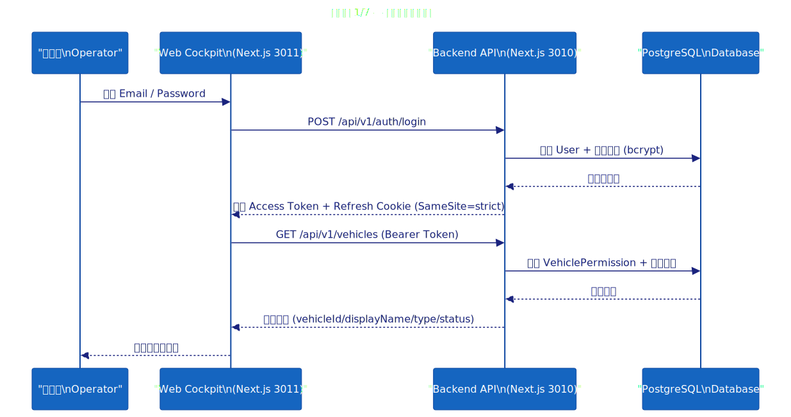

### 6.2 時序圖 2/7 — 獲取控制租約

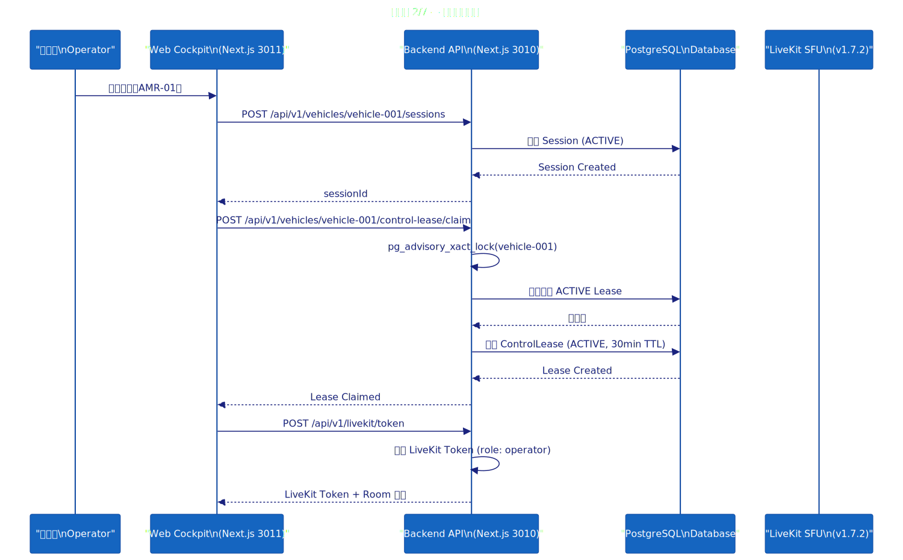

### 6.3 時序圖 3/7 — 連線 LiveKit 與串流

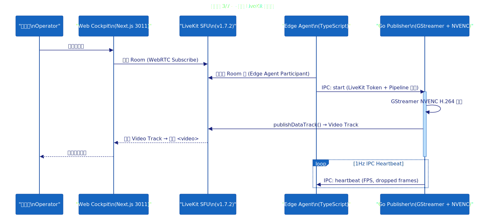

### 6.4 時序圖 4/7 — 控制命令與 Telemetry

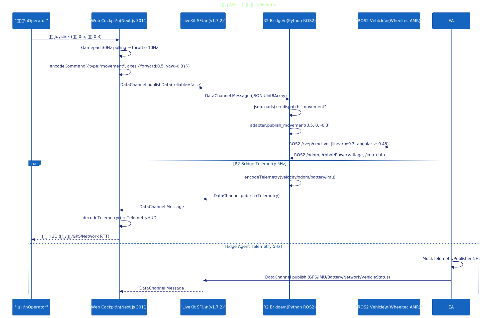

### 6.5 時序圖 5/7 — 心跳安全機制

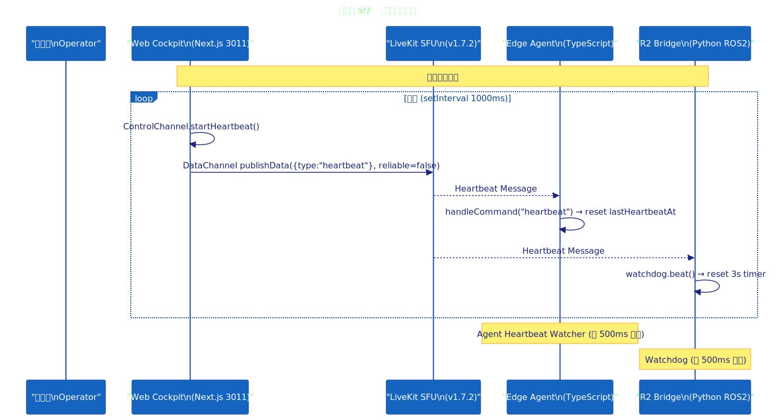

### 6.6 時序圖 6/7 — 異常場景：心跳超時與恢復

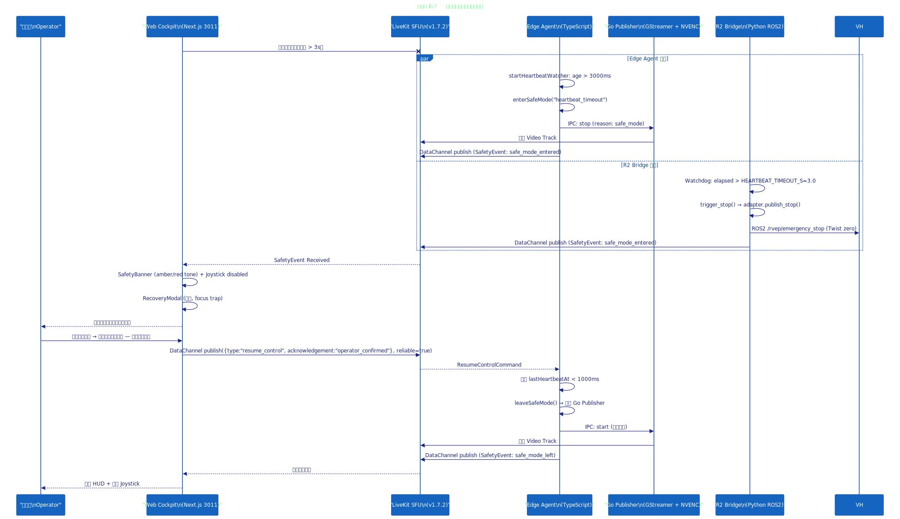

### 6.7 時序圖 7/7 — 釋放控制

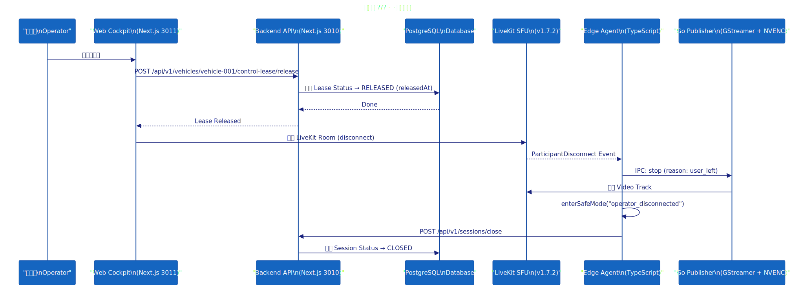

---

## 7. 介面規格總覽

### 7.1 REST API 端點

#### 認證 (`/api/v1/auth`)

| 方法 | 路徑 | 說明 | 認證 |
|------|------|------|------|
| POST | `/login` | Email/Password 登入，回傳 JWT Pair + httpOnly Cookie | 否 |
| POST | `/refresh` | 使用 Refresh Token 換發新 Access Token | Cookie |
| POST | `/logout` | 登出，失效 Refresh Token | Bearer |

#### 車輛 (`/api/v1/vehicles`)

| 方法 | 路徑 | 說明 | 角色 |
|------|------|------|------|
| GET | `/` | 列出車輛（Admin 全列；Operator/Viewer 僅有權限的） | ALL |
| GET | `/{vehicleId}/status` | 彙整儀表板資料（租約、Telemetry、在線狀態） | ALL |

#### 控制租約 (`/api/v1/vehicles/{vehicleId}/control-lease`)

| 方法 | 路徑 | 說明 | 角色 |
|------|------|------|------|
| GET | `/` | 查詢當前有效租約 | ALL |
| POST | `/claim` | 宣告/重新宣告控制權（30min TTL，可序列化交易） | OPERATOR+ |
| POST | `/release` | 釋放租約（僅當前持有者） | OPERATOR+ |
| POST | `/takeover` | 管理員強制接管（Revoke + Reassign） | ADMIN |

#### 權限 (`/api/v1/permissions`, `/api/v1/vehicles/{vehicleId}/permissions`)

| 方法 | 路徑 | 說明 | 角色 |
|------|------|------|------|
| GET | `/me` | 查詢當前使用者權限 | ALL |
| GET | `/{vehicleId}/permissions` | 列出車輛權限 | ADMIN |
| POST | `/{vehicleId}/permissions` | 授予/更新權限 | ADMIN |

#### LiveKit Token (`/api/v1/livekit`)

| 方法 | 路徑 | 說明 | 角色 |
|------|------|------|------|
| POST | `/token` | 簽發 LiveKit Room Token（依角色限定權限） | OPERATOR+ |

#### 稽核與資料 (`/api/v1`)

| 方法 | 路徑 | 說明 | 角色 |
|------|------|------|------|
| GET | `/audit` | 查詢 EventLog | ADMIN |
| GET | `/datasets` | 查詢 DatasetAsset | ADMIN |

#### 內部端點 (`/api/v1/internal`)

| 方法 | 路徑 | 說明 | 驗證 |
|------|------|------|------|
| POST | `/telemetry-frame` | Edge Agent 回報取樣 Telemetry（1Hz） | x-internal-token |
| POST | `/control-event` | Edge Agent 回報 Safety/Control 事件 | x-internal-token |
| POST | `/dataset-asset` | Edge Agent 註冊資料集產出 | x-internal-token |

### 7.2 LiveKit DataChannel 通訊協定

所有即時訊息透過 **LiveKit DataChannel（可靠模式）** 傳輸，以 JSON Lines 編碼，使用型別鑑別器區分：

| 訊息類型 | 鑑別器 | 方向 | 頻率 | 說明 |
|----------|--------|------|------|------|
| ControlCommand | `type` (6種) | Operator → Edge | 事件驅動 | 控制命令聯合型別 |
| TelemetryMessage | `kind: "telemetry"` | Edge → Cockpit | 5Hz | 車輛感測器資料 |
| SafetyEvent | `kind: "safety_event"` | Edge → Cockpit | 事件驅動 | 安全狀態轉換 |

#### ControlCommand 類型

| 類型 | 說明 | 附加欄位 |
|------|------|----------|
| `movement` | 移動控制 | `axes: {forward, lateral, yaw} ∈ [-1, 1]` |
| `emergency_stop` | 緊急停止 | 無 |
| `heartbeat` | 心跳（1Hz） | 無 |
| `resume_control` | 恢復控制 | `acknowledgement: "operator_confirmed"` |
| `action` | 通用動作 | `action: string, params?: Record<string, unknown>` |
| `config` | 配置變更 | `key: string, value: string | number | boolean` |

### 7.3 Edge Agent ↔ Go Publisher IPC 協定

- **傳輸層**：Unix Domain Socket
- **格式**：JSON Lines（每行一個 JSON 物件）
- **方向**：全雙工

| 訊息 | 方向 | 說明 |
|------|------|------|
| `hello` | Publisher → Agent | 啟動通知 |
| `heartbeat` | Publisher → Agent | 1Hz，含 FPS + dropped frames 指標 |
| `error` | Publisher → Agent | 錯誤通知（fatal / non-fatal） |
| `start` | Agent → Publisher | 開始串流（含 LiveKit Token + Pipeline 配置） |
| `stop` | Agent → Publisher | 停止串流（reason: user_request / safe_mode / shutdown） |

**重連策略**：Exponential Backoff（1s → 2s → 4s → 8s → 16s → 30s 上限，最多 10 次）

### 7.4 Edge Agent → Backend Internal API 協定

- **認證**：HTTP Header `x-internal-token`（與後端共享密鑰）
- **內容類型**：`application/json`

| 端點 | 頻率 | Payload |
|------|------|---------|
| `POST /internal/telemetry-frame` | 1Hz | 取樣 TelemetryFrame（GPS/IMU/Battery/Network） |
| `POST /internal/control-event` | 事件驅動 | 安全/控制事件（含 payload） |
| `POST /internal/dataset-asset` | Session 結束時 | 資料集產出註冊（含 SHA256、大小、持續時間） |

### 7.5 R2 Bridge ↔ ROS2 Topics

| ROS2 Topic | 方向 | 類型 | 說明 |
|------------|------|------|------|
| `/rvep/cmd_vel` | Bridge → Vehicle | geometry_msgs/Twist | 操作員控制命令（優先級 80） |
| `/cmd_vel` (mirror) | Bridge → Vehicle | geometry_msgs/Twist | 鏡像模式（直接馬達控制） |
| `/rvep/cmd_vel_stop` | Bridge → Vehicle | std_msgs/Empty | 緊急停止（優先級 100） |
| `/odom` | Vehicle → Bridge | nav_msgs/Odometry | 里程計回授 |
| `/robot/PowerValtage` | Vehicle → Bridge | 自定義 | 電源電壓 |
| `/mobile_base/sensors/imu_data` | Vehicle → Bridge | sensor_msgs/Imu | IMU 資料 |

**twist_mux 優先級配置**：

| 來源 | 優先級 | 說明 |
|------|--------|------|
| rvep_stop | 100 | 緊急停止（最高） |
| rvep_operator | 80 | 操作員控制 |
| nav2 | 50 | 自主導航 |
| joy | 10 | 搖桿（最低） |

### 7.6 心跳安全協定

```
Operator Cockpit                  Edge Agent / R2 Bridge
     │                                   │
     │──── heartbeat (1Hz) ─────────────►│
     │                                   ├── 重置 3 秒計時器
     │                                   │
     │    [網路中斷]                      │
     │    (心跳停止 > 3 秒)               │
     │                                   ├── 進入 Safe Mode
     │                                   ├── IPC: stop Publisher
     │                                   ├── 零速度指令
     │◄──── safety_event: safe_mode_entered ──┤
     │                                   │
     │──── resume_control (acknowledged) ──►│
     │                                   ├── 離開 Safe Mode
     │                                   ├── IPC: start Publisher
     │◄──── safety_event: safe_mode_left ───┤
```

### 7.7 資料庫連線

| 項目 | 配置 |
|------|------|
| 資料庫 | PostgreSQL 16.4-alpine |
| 連接埠 | 5432（僅限 loopback） |
| ORM | Prisma v6 |
| Connection Pool | 預設 Prisma 內部池 |
| 迁移 | `prisma migrate deploy` |

### 7.8 WebRTC 網路配置

| 項目 | 配置 |
|------|------|
| SFU | LiveKit v1.7.2 |
| 連接埠 | 7880（WebRTC） |
| TURN | 3478（UDP/TCP） |
| ICE 範圍 | 50000-60000 |
| 編碼 | H.264 (NVENC) |
| 頻道 | 雙向 DataChannel（SCTP，可靠模式） |

### 7.9 控制命令 API 與 ROS2 傳輸格式

#### 7.9.1 命令管線（Command Pipeline）

```
Cockpit (TypeScript)          LiveKit SFU          Edge Agent (TypeScript)
     │                             │                      │
     │── JSON Uint8Array ─────────►│── JSON Uint8Array ──►│  handleCommand()
     │   publishData(reliable)     │    DataChannel       │    └─ dispatch by type
     │                             │                      │          │
     │                             │                      │   movement → GoPublisher IPC (not relay)
     │                             │                      │   emergency_stop → enterSafeMode()
     │                             │                      │   heartbeat → reset lastHeartbeatAt
     │                             │                      │   resume_control → leaveSafeMode()
     │                             │                      │   action → executeAction()
     │                             │                      │   config → applyConfig()
     │                             │                      │
     │                             │         R2 Bridge (Python)
     │                             │              │
     │──── (same DataChannel) ─────┼─────────────►│  on_data callback
     │                             │              │    └─ json.loads() → dispatch by "type"
     │                             │              │          │
     │                             │              │   movement → adapter.publish_movement(fwd, lat, yaw)
     │                             │              │              └─ geometry_msgs/Twist → /rvep/cmd_vel
     │                             │              │   emergency_stop → adapter.publish_emergency_stop()
     │                             │              │   heartbeat → watchdog.beat()
```

Cockpit 與 R2 Bridge 都在同一個 LiveKit Room 中 **獨立訂閱** DataChannel，Edge Agent **不做 relay**。

#### 7.9.2 ControlCommand 完整結構（JSON，`packages/shared/src/control-commands.ts`）

所有命令共用 Base Fields：

| 欄位 | 類型 | 說明 |
|------|------|------|
| `vehicleId` | `string` | 車輛 ID |
| `sessionId` | `string` | 當前 Session ID |
| `connectionEpoch` | `number` (int, ≥0) | 連線紀元（用於 G2G 延遲計算） |
| `seq` | `number` (int, ≥0) | 序列號（每條新命令遞增） |
| `timestamp` | `string` (ISO 8601) | UTC 時間戳（毫秒精度） |
| `type` | `"movement"` / `"emergency_stop"` / `"heartbeat"` / `"resume_control"` / `"action"` / `"config"` | 鑑別器 |

**MovementCommand**（Cockpit `Joystick.tsx`，30Hz Gamepad 輪詢，實際以 10Hz 限頻）：

```json
{
  "type": "movement",
  "vehicleId": "r2-01",
  "sessionId": "ses_abc123",
  "connectionEpoch": 1719715200,
  "seq": 42,
  "timestamp": "2025-06-30T12:00:00.000Z",
  "axes": {
    "forward": 0.5,     // [-1, 1] 前進/後退
    "lateral": 0,       // [-1, 1] 目前輸出固定 0 (註)
    "yaw": -0.3         // [-1, 1] 旋轉（正值=右轉）
  }
}
```

> **註**：`lateral` 在已知實作中固定為 `0`（`Joystick.tsx:77` 只產出 `forward + yaw`）。schema 保留該欄位供未來擴充。

**EmergencyStopCommand**（`ControlChannel.sendEmergencyStop()`，`reliable=true`）：

```json
{
  "type": "emergency_stop",
  "vehicleId": "r2-01",
  "sessionId": "ses_abc123",
  "connectionEpoch": 1719715200,
  "seq": 99,
  "timestamp": "2025-06-30T12:00:05.000Z"
}
```

**HeartbeatMessage**（`ControlChannel.startHeartbeat()`，`reliable=false`，1Hz）：

```json
{
  "type": "heartbeat",
  "vehicleId": "r2-01",
  "sessionId": "ses_abc123",
  "connectionEpoch": 1719715200,
  "seq": 43,
  "timestamp": "2025-06-30T12:00:01.000Z"
}
```

**ResumeControlCommand**（RecoveryModal，`reliable=true`）：

```json
{
  "type": "resume_control",
  "vehicleId": "r2-01",
  "sessionId": "ses_abc123",
  "connectionEpoch": 1719715200,
  "seq": 100,
  "timestamp": "2025-06-30T12:01:00.000Z",
  "acknowledgement": "operator_confirmed"
}
```

**ActionCommand**（通用擴充點）：

```json
{
  "type": "action",
  "vehicleId": "r2-01",
  "sessionId": "ses_abc123",
  "connectionEpoch": 1719715200,
  "seq": 44,
  "timestamp": "2025-06-30T12:00:02.000Z",
  "action": "horn",
  "params": { "duration_ms": 500 }
}
```

#### 7.9.3 ROS2 VehicleAdapter 抽象層（`apps/r2-bridge/r2_bridge/vehicle_adapter.py`）

```python
class VehicleAdapter(ABC):
    name: str = "abstract"

    def init_publishers(self, node: Node) -> None:
        """建立 ROS2 Publisher（init 時呼叫一次）"""

    def publish_movement(self, forward: float, lateral: float, yaw: float) -> None:
        """將正規化軸 ([-1, 1]) 轉譯為車輛特定命令"""

    def publish_emergency_stop(self) -> None:
        """即時零速度停止（無前置條件）"""

    def capabilities(self) -> list[str]:
        return ["movement"]  # 子類別可擴充
```

**`WheeltecAMRAdapter`**（差速驅動輪車 R2）：

| 參數 | 預設值 | 說明 |
|------|--------|------|
| `MAX_LINEAR_MS` | 0.6 | 前進/橫移最大線速度（m/s） |
| `MAX_ANGULAR_RADS` | 1.5 | 旋轉最大角速度（rad/s） |
| `publish_mode` | `"mirror"` | `mirror` = 同時發佈到 `/rvep/cmd_vel` + `/cmd_vel`；`csm` = 僅 `/rvep/cmd_vel` |

```python
def publish_movement(self, forward: float, lateral: float, yaw: float) -> None:
    msg = Twist()
    msg.linear.x = forward * self.MAX_LINEAR_MS    # 前進
    msg.linear.y = lateral * self.MAX_LINEAR_MS    # 橫移
    msg.angular.z = yaw * self.MAX_ANGULAR_RADS    # 旋轉
    self._rvep_cmd_pub.publish(msg)                # /rvep/cmd_vel
    if self._cmd_pub is not None:
        self._cmd_pub.publish(msg)                 # /cmd_vel (mirror mode)

def publish_emergency_stop(self) -> None:
    zero = Twist()  # 所有欄位 = 0
    self._stop_pub.publish(zero)       # /rvep/emergency_stop
    self._rvep_cmd_pub.publish(zero)   # /rvep/cmd_vel (停止仲裁)
    if self._cmd_pub is not None:
        self._cmd_pub.publish(zero)    # /cmd_vel (mirror mode direct)
```

#### 7.9.4 ROS2 Topic 一覽

| Topic | 類型 | Pub | Sub | 說明 |
|-------|------|-----|-----|------|
| `/rvep/cmd_vel` | `geometry_msgs/Twist` | Bridge | Vehicle（twist_mux pri=80） | 操作員控制命令 |
| `/cmd_vel` (mirror) | `geometry_msgs/Twist` | Bridge | Vehicle（直接馬達） | 鏡像模式 bypass twist_mux |
| `/rvep/emergency_stop` | `geometry_msgs/Twist` | Bridge | Vehicle（twist_mux pri=100） | 緊急停止（零速度） |
| `/odom` | `nav_msgs/Odometry` | Vehicle | Bridge | 里程計（velocity + pose） |
| `/robot/PowerValtage` | 自定義 | Vehicle | Bridge | 電源電壓（battery 計算） |
| `/mobile_base/sensors/imu_data` | `sensor_msgs/Imu` | Vehicle | Bridge | IMU 回授 |

#### 7.9.5 twist_mux 仲裁優先級

| 來源 | 優先級 | 說明 |
|------|--------|------|
| `rvep_stop` | 100 | 緊急停止（最高優先） |
| `rvep_operator` | 80 | 操作員控制 |
| `nav2` | 50 | 自主導航 |
| `joy` | 10 | 搖桿（最低優先） |

#### 7.9.6 命令解碼流程對照（Cockpit ↔ R2 Bridge）

```
Cockpit Joystick.tsx
  │
  ├─ Gamepad API 30Hz polling
  ├─ throttle to 10Hz
  ├─ encodeCommand({ type:"movement", axes:{forward,yaw} })
  │   └─ new TextEncoder().encode(JSON.stringify(cmd))
  ├─ DataChannel.publishData(uint8array, {reliable: false})
  │
  ▼
LiveKit SFU (forward)
  │
  ▼ (dual subscribers)
  │
  ┌────────────────────┬──────────────────────────────┐
  │ Edge Agent         │ R2 Bridge (Python)            │
  │                    │                                │
  │ onData callback    │ on_data callback               │
  │ decodeCommand()    │ json.loads()                   │
  │ → handleCommand()  │ → dispatch by cmd["type"]      │
  │                    │                                │
  │ movement:          │ movement:                      │
  │   IPC start/update │   adapter.publish_movement(    │
  │   (Go Publisher)   │     forward, lateral, yaw)     │
  │                    │     └─ Twist → /rvep/cmd_vel   │
  │ emergency_stop:    │ emergency_stop:                │
  │   enterSafeMode()  │   adapter.publish_emergency_stop()
  │                    │     └─ Twist zero → /rvep/emergency_stop
  │ heartbeat:         │ heartbeat:                     │
  │   reset timer      │   watchdog.beat()              │
  │ resume_control:    │   (no-op, edge agent handles)  │
  │   leaveSafeMode()  │                                │
  └────────────────────┴──────────────────────────────┘
```

#### 7.9.7 Edge Agent 控制命令處理（`apps/mock-edge/src/index.ts`）

| 命令類型 | 處理函式 | 行為 |
|----------|----------|------|
| `movement` | `handleMovementCommand()` | 更新 GoPublisher IPC 速度參數 |
| `emergency_stop` | `handleEmergencyStop()` | `enterSafeMode("emergency_stop")` → IPC stop + 零速度 + 廣播 `safe_mode_entered` |
| `heartbeat` | `handleHeartbeat()` | 重置 `lastHeartbeatAt = Date.now()` |
| `resume_control` | `handleResumeControl()` | 檢查心跳新鮮度 (`< 1000ms`) → `leaveSafeMode()` |
| `action` | `executeAction()` | 執行通用動作（如 horn） |
| `config` | `applyConfig()` | 動態更新參數（如 max speed） |

#### 7.9.8 R2 Bridge 控制命令處理（`apps/r2-bridge/r2_bridge/main.py`）

| `cmd["type"]` | 處理 |
|---------------|------|
| `movement` | `pub.publish_cmd(fwd, lat, yaw)` → `adapter.publish_movement()` → `Twist()` → `/rvep/cmd_vel` |
| `emergency_stop` | `pub.publish_stop()` → `adapter.publish_emergency_stop()` → `Twist()` zero → 停止所有 topic |
| `heartbeat` | `watchdog.beat()`（重置 3 秒計時器） |

兩個接收端（Edge Agent + R2 Bridge）對 `movement` 的處理方式不同：
- **Edge Agent**：部分實作（mock）只將速度參數傳遞給 Go Publisher 用於 FPV 模擬（非實際馬達控制）
- **R2 Bridge**：實際轉譯為 ROS2 Twist 發佈至車輛底盤

---

## 8. 產生 Mermaid 圖片的步驟

### 8.1 前置需求

- **Node.js** >= 18
- **npx**（隨 Node.js 安裝）

### 8.2 安裝 Mermaid CLI

```bash
# 使用 npx 直接執行（不需全域安裝）
npx @mermaid-js/mermaid-cli --version
```

初次執行會自動下載 `puppeteer`（Chromium），需要一些時間。之後會快取在本機。

### 8.3 語法驗證 + 產生 SVG

所有指令在 `Mermaid/` 目錄下執行：

```bash
cd Mermaid
```

**逐一產生：**

```bash
# 系統架構圖（C4）
npx @mermaid-js/mermaid-cli@latest --input architecture.mmd --output architecture.svg -s 2 -b transparent

# 使用案例圖（flowchart）
npx @mermaid-js/mermaid-cli@latest --input use-case.mmd --output use-case.svg -s 2 -b transparent

# 資料庫 ER 圖
npx @mermaid-js/mermaid-cli@latest --input er-diagram.mmd --output er-diagram.svg -s 2 -b transparent

# 通訊流程圖
npx @mermaid-js/mermaid-cli@latest --input communication-flow.mmd --output communication-flow.svg -s 2 -b transparent

# 時序圖（完整版）
npx @mermaid-js/mermaid-cli@latest --input sequence.mmd --output sequence.svg -s 2 -b transparent

# 時序圖分鏡 1-7
npx @mermaid-js/mermaid-cli@latest --input sequence-01-auth-fleet.mmd --output sequence-01-auth-fleet.svg -s 2 -b transparent
npx @mermaid-js/mermaid-cli@latest --input sequence-02-claim-lease.mmd --output sequence-02-claim-lease.svg -s 2 -b transparent
npx @mermaid-js/mermaid-cli@latest --input sequence-03-livekit-stream.mmd --output sequence-03-livekit-stream.svg -s 2 -b transparent
npx @mermaid-js/mermaid-cli@latest --input sequence-04-control-telemetry.mmd --output sequence-04-control-telemetry.svg -s 2 -b transparent
npx @mermaid-js/mermaid-cli@latest --input sequence-05-heartbeat.mmd --output sequence-05-heartbeat.svg -s 2 -b transparent
npx @mermaid-js/mermaid-cli@latest --input sequence-06-safe-mode-recovery.mmd --output sequence-06-safe-mode-recovery.svg -s 2 -b transparent
npx @mermaid-js/mermaid-cli@latest --input sequence-07-release.mmd --output sequence-07-release.svg -s 2 -b transparent

# 個別角色使用案例圖
npx @mermaid-js/mermaid-cli@latest --input use-case-operator.mmd --output use-case-operator.svg -s 2 -b transparent
npx @mermaid-js/mermaid-cli@latest --input use-case-admin.mmd --output use-case-admin.svg -s 2 -b transparent
npx @mermaid-js/mermaid-cli@latest --input use-case-viewer.mmd --output use-case-viewer.svg -s 2 -b transparent
npx @mermaid-js/mermaid-cli@latest --input use-case-edge.mmd --output use-case-edge.svg -s 2 -b transparent
npx @mermaid-js/mermaid-cli@latest --input use-case-vehicle.mmd --output use-case-vehicle.svg -s 2 -b transparent
```

**參數說明：**

| 參數 | 說明 |
|------|------|
| `--input` | 輸入的 `.mmd` 檔案路徑 |
| `--output` | 輸出的圖片路徑（SVG / PNG / PDF） |
| `-s` 或 `--scale` | 縮放比例（`2` 為 2x Retina） |
| `-b` 或 `--backgroundColor` | 背景色（`transparent` 為透明） |

### 8.4 批次產生（PowerShell）

```powershell
Get-ChildItem -Filter *.mmd | ForEach-Object {
    $name = $_.BaseName
    npx @mermaid-js/mermaid-cli@latest --input "$name.mmd" --output "$name.svg" -s 2 -b transparent
}
```

### 8.5 輸出格式

- **SVG**：向量格式，適合嵌入網頁與文件（預設，如上指令）
- **PNG**：點陣格式。將副檔名改為 `.png` 即可輸出 PNG
- **PDF**：整頁 PDF。將副檔名改為 `.pdf` 即可輸出 PDF

### 8.6 已知限制

| 圖型 | 狀態 | 說明 |
|------|------|------|
| C4Context (architecture) | ✅ 支援 | Mermaid v10+ 原生支援 C4 圖 |
| flowchart (use-case) | ✅ 替代方案 | Mermaid v11 已移除 useCase 圖型，改用 flowchart |
| erDiagram | ✅ 支援 | 原生 ER 圖支援 |
| graph TB (communication-flow) | ✅ 支援 | 注意 `title` 不能作為 flowchart 的關鍵字 |
| sequenceDiagram | ✅ 支援（×7 分鏡） | 原生時序圖支援，依階段切分為 7 張獨立圖表 |

### 8.7 疑難排解

**「No diagram type detected」錯誤**

改用對應的圖型關鍵字：

| 語法錯誤 | 修正 |
|----------|------|
| `useCase` | → `flowchart`（Mermaid v11 已移除） |
| `graph TB title="..."` | → 移除 `title`，改為註解 `%% title: ...` |
| `useCase "..."` | → 改用 flowchart 的 `[...]` 節點語法 |

**「Puppeteer failed to launch」錯誤**

- 確認系統已安裝 Chromium 或 Edge
- 設定 `PUPPETEER_SKIP_DOWNLOAD=false` 重新安裝
- 或使用 `--puppeteerConfigFile` 指定自訂 puppeteer 配置

---

## 9. 已知問題與注意事項 (Known Issues)

### 9.1 架構正確性

| # | 問題 | 影響範圍 | 說明 |
|---|------|----------|------|
| 1 | `Joystick.lateral` 固定輸出 0 | UC4 | Cockpit Joystick 目前只產出 forward + yaw，lateral 雖有 schema 保留但前端未實作 |
| 2 | Edge Agent 與 Cockpit 的 `movement` 交集 | UC4 | Edge Agent 收到 movement command 僅做安全阻擋檢查（safe_mode 時拒絕），不 relay 至 R2 Bridge；R2 Bridge 自行訂閱相同 DataChannel |
| 3 | `lastHeartbeatAt === 0` 初始 safe_mode | UC7 | Edge Agent boot 時預設 safe_mode，需 operator 發送一次 resume_control 才解除（需心跳先通過） |
| 4 | R2 Bridge Watchdog 獨立於 Edge Agent | UC7 | 兩個 watchdog 各自運作（Edge 500ms 間隔 / R2 3s timeout），狀態可能不一致 |
| 5 | 心跳恢復檢查 `lastHeartbeatAt < 1000ms` | UC8 | Edge Agent 要求心跳新鮮度 <1s 才接受 resume_control，若心跳剛好過期需等待下一 Hz |
| 6 | `ControlLease` 未強制對應 Session | UC3 | lease 需要 session 存在但不強制 FK cascade，可能產生孤兒 lease |
| 7 | `EventLog.vehicleId` 非 FK | UC10 | EventLog 使用 raw string 非 FK constraint，可能出現不一致 |
| 8 | `TelemetryFrame.sessionId` 非 FK | UC14 | TelemetryFrame.sessionId 為商業識別碼字串，非 Session.id FK |
| 9 | `BRIDGE_PUBLISH_MODE=mirror` bypass twist_mux | UC15 | mirror mode 直接發佈 `/cmd_vel`，跳過 twist_mux 仲裁，可能與 nav2 衝突 |
| 10 | Go Publisher 無獨立安全邏輯 | UC13 | 安全邏輯完全依賴 Edge Agent IPC，Go Publisher 本身不做心跳檢查 |

### 9.2 安全性

| # | 問題 | 嚴重性 | 說明 |
|---|------|--------|------|
| 1 | Internal API 僅用 shared secret token | 中 | `x-internal-token` 為固定字串，prod 應換為 mTLS 或 signed JWT |
| 2 | JWT refresh token 14天 TTL | 低 | 長 TTL 增加洩漏風險，建議實作輪換 + 撤銷清單 |
| 3 | ROS2 Topics 無加密 | 低 | Vehicle LAN 內無加密，實體隔離為唯一保護 |
| 4 | LiveKit dev key 存在 docker-compose | 中 | `devkey:devsecret` 為已知明文，prod 需換為 secret key |
| 5 | 帳號鎖定 15 分鐘僅靠 failedLoginCount | 低 | 無 CAPTCHA 或速率限制（API 層面） |

### 9.3 監控與可觀測性

| # | 問題 | 說明 |
|---|------|------|
| 1 | 無 Prometheus metrics endpoint | 目前無標準化 metrics 輸出（僅 console.log） |
| 2 | Telemetry 無 schema validation on read | Edge Agent 發佈 Telemetry 有 Zod schema，但 Cockpit decodeTelemetry() 為寬鬆解析 |
| 3 | Edge Agent 無健康檢查 HTTP endpoint | 無法由外部探測 Agent 存活狀態 |
| 4 | 斷線重連無指數退避 | 目前 mock-edge 無實作 reconnection backoff |

### 9.4 測試覆蓋

| # | 問題 | 說明 |
|---|------|------|
| 1 | 前端無 unit test | web/ 目錄無測試框架設定 |
| 2 | backend 僅少數 route 有 test | 僅 `auth/login` 有 vitest + supertest 測試 |
| 3 | mock-edge 無測試 | edge agent 模擬器無任何測試 |
| 4 | R2 Bridge 無測試 | Python ROS2 bridge 無 unit/integration test |

### 9.5 文件與圖表

| # | 問題 | 說明 |
|---|------|------|
| 1 | C4 圖中 boundary 標籤文字長度 | 長 boundary 名稱可能導致 SVG 文字重疊（已縮減為 2-3 行） |
| 2 | Dark theme 相容性 | 所有 SVG 以 `-b "#FFF9C4"`（淡黃底） + `theme: base/dark` 生成，VS Code 黑底可讀 |
| 3 | Mermaid CLI v11 移除 useCase | 使用案例圖以 flowchart 替代，語意不完全對等 |
| 4 | 部分 ER 圖關聯線無 label | Mermaid ER 不支援所有關係線標籤（已補說明在 §4.2） |

### 9.6 NVENC 版本不匹配問題

| # | 問題 | 說明 |
|---|------|------|
| 1 | NVENC 版本與 GStreamer plugin 不匹配 | 非 AGX Orin 或 JetPack 版本不對應時，`nvv4l2h264enc` 無法載入，需降級為純 CPU `x264enc` 編碼 |

**影響範圍：** `apps/edge-publisher-go/` — Go Video Publisher

**替代方案：** 使用 `pipelineOverride` 傳入軟體編碼 pipeline：
```
v4l2src ! videorate ! videoconvert ! x264enc ! h264parse ! appsink
```

### 9.7 權限與介面缺口

#### 後端權限定義

| 操作 | Admin | Operator | Edge Agent |
|------|-------|----------|------------|
| **Room** — Create | ✅ | ❌ | ❌ |
| **Room** — Read | ✅ | ✅ | ❌ |
| **Room** — Update | ✅ (basic info) | ❌ | ❌ |
| **Room** — Delete | ✅ | ❌ | ❌ |
| **Vehicle** — Create | ✅ | ❌ | ❌ |
| **Vehicle** — Read | ✅ | ✅ | ❌ |
| **Vehicle** — Update | ✅ | ✅ (僅 `currentRoomId`, `controlSettings`) | ❌ |
| **Vehicle** — Delete | ✅ | ❌ | ❌ |

- Admin 擁有所有 CRUD 權限
- Operator 可讀取 Room/Vehicle，僅能更新 Vehicle 的 `currentRoomId` 與 `controlSettings`
- Edge Agent 不直接存取後端 API，僅透過 Edge Agent IPC 與 Publisher 溝通

#### 前端介面缺口

後端雖定義了 Admin CRUD 權限，但 **前端 `apps/web/` 完全無對應的 CRUD 操作介面**：

| # | 缺少的功能 | 說明 |
|---|-----------|------|
| 1 | 無 Room 管理頁面 | 前端無任何 Room 的 create/edit/delete 畫面，LiveKit Room 僅用於 WebRTC 串流 |
| 2 | 無 Vehicle create/edit/delete 介面 | `apps/web/src/app/vehicles/page.tsx` 僅為唯讀儀表板，無新增/編輯/刪除按鈕或表單 |
| 3 | 無對應 API client 函式 | `apps/web/src/lib/api-client.ts` 僅有 GET 查詢與 auth 操作，無 `createRoom`、`deleteVehicle` 等 CRUD 呼叫 |
| 4 | 無表單/對話框元件 | 前端無 form/modal/dialog 元件用於資料編輯（唯一 modal 是安全 recovery） |

Admin 目前需直接操作資料庫來管理 Room 與 Vehicle，前端僅提供監控與遙控功能。

### 9.8 註冊功能缺失

| # | 問題 | 說明 |
|---|------|------|
| 1 | 無註冊端點 | `/api/v1/auth/` 僅有 `login`、`refresh`、`logout`，無 `register` 或 `signup` |
| 2 | 帳號需由 Admin 手動新增 | 無任何註冊流程或 Admin 建立使用者的 API |

### 9.9 Edge Publisher 無 LiveKit Token 更新機制

| # | 問題 | 嚴重性 | 說明 |
|---|------|--------|------|
| 1 | Edge Publisher 僅在啟動時取得一次 LiveKit Token | 高 | `cmd/publisher/main.go:180` 從 IPC `start` 訊息取得 token，後續所有重連皆使用相同 token |
| 2 | LiveKit Token TTL 僅 1 小時 | 高 | `apps/backend/src/lib/livekit.ts:13` — `TOKEN_TTL_SECONDS = 3600`，超過即失效 |
| 3 | 無 token 更新端點供 edge 使用 | 中 | Edge Publisher 不具備 backend API 認證，無法呼叫 `/api/v1/livekit/token` 更新 |
| 4 | 重連僅 3 次嘗試即放棄 | 中 | `internal/publisher/livekit.go:30-32` — `maxReconnectAttempts = 3`，失敗後 publisher 退出並回報 `ErrLivekitAuthFailed` |
| 5 | 前端亦無 LiveKit Token 更新機制 | 低 | 前端 control page 在 mount 時取得一次 token，斷線超過 1h 後同樣無法重連 |

**影響範圍：** `apps/edge-publisher-go/` — Go Video Publisher

**風險：** 若車輛運行超過 1 小時且 LiveKit 連線中斷（網路抖動、SFU 重啟等），Edge Publisher 將因 token 過期而無法重連，最終 publisher 進程退出，需由 Edge Agent 重新啟動整個流程（重新 IPC handshake 取得新 token）。

**可能解法：**
1. 在 Edge Publisher 加入 `/api/v1/livekit/token` HTTP 呼叫能力（需先取得 backend auth token）
2. 延長 LiveKit Token TTL（降低更換頻率但不根本解決）
3. 由 Edge Agent 監控 publisher 健康狀態，在 token 到期前重新觸發 IPC handshake

### 9.10 雙搖桿支援與 ROS2 Joy API 缺口

| # | 問題 | 嚴重性 | 說明 |
|---|------|--------|------|
| 1 | Touch 虛擬搖桿僅單一、lateral 固定 0 | 中 | `Joystick.tsx:62` — lateral 寫死 0，mecanum/holonomic 車體無法橫移；無第二根虛擬搖桿供右手指揮 |
| 2 | 無 tank 模式（左右履帶獨立控制） | 中 | Movement schema (`control-commands.ts`) 僅 forward/lateral/yaw 三軸，無 leftTrack/rightTrack 概念，無法對應 tank/skid-steer 車體 |
| 3 | `joystickSide` store 存在但未使用 | 低 | `cockpit-store.ts:7` 定義 `JoystickSide = "left" \| "right"` 但無任何 component 讀取此值 |
| 4 | 無 ROS2 `sensor_msgs/Joy` 訊息支援 | 中 | R2 Bridge (`main.py`) 直接 JSON → `geometry_msgs/Twist`，從不發布 `/joy` topic，無法與 ROS2 生態系中的 `teleop_twist_joy`、`joy_node` 等標準 node 整合 |
| 5 | Gamepad 僅使用第一支搖桿 | 低 | `useGamepad.ts:55` — `navigator.getGamepads()[0]`，無法選擇多支 controller |

**影響範圍：** 控制體驗、ROS2 生態相容性

**說明：** 目前僅支援單一虛擬搖桿 + gamepad 三軸（forward/lateral/yaw），缺乏真正的雙搖桿操作（如 tank steering）以及標準 ROS2 `/joy` API 整合，限制了與外部 ROS2 joy teleop 工具的互通性。

### 9.11 mock-edge 僅使用虛擬資料，未讀取真實 ROS2 數值

| # | 問題 | 嚴重性 | 說明 |
|---|------|--------|------|
| 1 | Telemetry 全為 `Math.random()` 假資料 | 高 | `telemetry-publisher.ts:112-168` — GPS 以 Taipei 101 為中心隨機漫步，IMU/battery 皆為模擬值 |
| 2 | Movement command 僅 `console.log` | 高 | `index.ts:231` — 收到 forward/yaw 指令僅寫 log，未發布至 ROS2 `/cmd_vel` |
| 3 | 無 ROS2 topic subscriber | 高 | 未訂閱 `/odom`、`/robot/PowerValtage`、`/imu_data`（r2-bridge 已有實作） |
| 4 | 無 VehicleAdapter 抽象層 | 中 | r2-bridge 有 `vehicle_adapter.py`，mock-edge 無對應 TypeScript 版本 |
| 5 | 無法在無 ROS2 環境開發 | 低 | mock 模式應保留（透過 config 切換 `mock=true/false`）支援純前端開發 |

**影響範圍：** `apps/mock-edge/` — 模擬邊緣代理人

**說明：** mock-edge 目前作為開發用的 Edge Agent 模擬器，但其 Telemetry 資料完全來自 `Math.random()` 假資料，且 movement command 僅寫 log 不發布至 ROS2 topic。r2-bridge (`main.py`) 已有完整的 ROS2 訂閱/發布實作，應將 mock-edge 改為可選擇真實 ROS2 模式（讀取實際 sensor 資料傳至介面）或 mock 模式。

### 9.12 相機發布重複實作

| # | 問題 | 嚴重性 | 說明 |
|---|------|--------|------|
| 1 | 兩套獨立相機發布系統 | 高 | Go Publisher (`edge-publisher-go/`) 使用 NVENC + livekit-server-sdk-go；`camera-publisher.sh` (`r2-bridge/`) 使用 Bash + gst-launch + `lk` CLI |
| 2 | 無統一配置格式 | 高 | Go publisher 採用 YAML camera profile；shell script 使用環境變數 |
| 3 | 個別生命週期管理 | 中 | Go publisher 由 Edge Agent IPC 管理；`camera-publisher.sh` 由獨立的 `r2-camera-publisher.service` 管理 |
| 4 | AVCC vs Annex B 位元流差異 | 低 | Go publisher 使用 `stream-format=avc` 再轉 Annex B；shell script 使用 `byte-stream=true` 直接輸出 |
| 5 | 硬體編碼 vs 軟體編碼 | 中 | Go publisher 預設 NVENC 硬體編碼；shell script 使用 x264enc 軟體編碼 |

**影響範圍：** `apps/edge-publisher-go/` + `apps/r2-bridge/r2_bridge/camera-publisher.sh`

**說明：** 專案中有兩套完全獨立且無共享程式碼的相機發布系統。Go Publisher 是目標架構（支援 NVENC 硬體編碼、IPC 管理、YAML 配置），但 R2 車輛仍使用舊的 Bash `camera-publisher.sh`（x264enc 軟體編碼、lk CLI、systemd 管理）。應將 R2 使用的 USB camera pipeline 整合進 Go Publisher 架構，建立統一 camera profile 實現單一發布層。

---

## 10. Room / Vehicle / Identity 命名規則

### 10.1 Room Name

**規則：** `ugv-{vehicleId}`

| 來源 | 行數 | 值 |
|------|------|----|
| `apps/backend/src/lib/livekit.ts` | 44 | `const roomName = \`ugv-${vehicleId}\`;` |
| `apps/mock-edge/src/index.ts` | 52 | `const ROOM_NAME = \`ugv-${VEHICLE_ID}\`;` |

已知值（配置/環境變數）：

| 檔案 | Room 值 |
|------|---------|
| `apps/edge-publisher-go/configs/zed-x-front.yaml` | `ugv-vehicle-001` |
| `apps/edge-publisher-go/configs/zed-x-rear.yaml` | `ugv-vehicle-001` |
| `apps/r2-bridge/README.md` | `ugv-vehicle-001` |

### 10.2 Vehicle ID

**規則：** `{prefix}-{number}`（業務識別碼，非 DB UUID）

| 車輛 | 值 | 定義位置 |
|------|-----|----------|
| Seed 車輛 | `vehicle-001` | `apps/backend/prisma/seed.ts:84` |
| R2 車輛（預設） | `r2-001` | `apps/r2-bridge/r2_bridge/main.py:46` |

### 10.3 LiveKit Participant Identity

| 角色 | 規則 | 範例 | 定義位置 |
|------|------|------|----------|
| Operator / Viewer / Admin | `{role}-{userId}` | `operator-clj4abc...` | `apps/backend/src/lib/livekit.ts:45` |
| Edge Agent | `edge-{vehicleId}` | `edge-vehicle-001` | `apps/mock-edge/src/index.ts:53` |
| Camera Publisher（IPC） | `edge-{cameraId}` | `edge-front`, `edge-rear` | YAML camera profiles, `go-publisher-manager.ts:319` |
| Camera Publisher（USB fallback） | `r2-camera` | `r2-camera` | `cmd/publisher/direct.go:110` |
| R2 Bridge（舊有） | `r2-{vehicleId}-bridge` | `r2-001-bridge` | `r2-bridge/README.md:105` |

### 10.4 Video Track Name

**規則：** `{identity}-video`

| identity | Track Name | 定義位置 |
|----------|-----------|----------|
| `edge-front` | `edge-front-video` | `internal/publisher/livekit.go:92` |
| `edge-rear` | `edge-rear-video` | 同上 |
| `edge-smoke` | `edge-smoke-video` | 同上 |

### 10.5 Unix Socket Path

**規則：** `/var/run/rvep/{vehicleId}/publisher-{cameraId}.sock`

| 來源 | 行數 |
|------|------|
| `apps/edge-publisher-go/systemd/rvep-publisher@.service` | 16 |
| `apps/mock-edge/src/go-publisher-manager.ts` | 136 |

### 10.6 環境變數

| 變數 | 預設值 | 用途 |
|------|--------|------|
| `VEHICLE_ID` | `vehicle-001` / `r2-001` | 車輛業務識別碼 |
| `ROOM` | (必填) | LiveKit room name |
| `IDENTITY` | `r2-camera` | Publisher participant identity |
| `LIVEKIT_URL` | `ws://192.168.68.68:7880` | LiveKit 伺服器位址 |
| `LIVEKIT_API_KEY` | `devkey` | LiveKit API 金鑰 |
| `LIVEKIT_API_SECRET` | `devsecret` | LiveKit API 密鑰 |
| `RVEP_SOCKET_PATH` | — | IPC Unix socket path（含 vehicleId + cameraId） |
| `RVEP_CAMERA_PROFILE` | — | YAML camera profile 路徑 |

### 10.7 Camera Profile YAML 欄位

| YAML Key | 說明 | 範例值 |
|----------|------|--------|
| `cameraId` | 邏輯相機識別碼 | `front`, `rear` |
| `identity` | LiveKit participant identity | `edge-front`, `edge-rear` |
| `trackName` | 發布的 video track label | `zedx-front`, `zedx-rear` |
| `livekit.room` | 要加入的 room name | `ugv-vehicle-001` |

---

## 11. 待解決問題優先度排名

依影響範圍與嚴重性排序，供未來開發決策參考：

| 優先度 | 問題 | 分類 | 主要影響 |
|--------|------|------|----------|
| **P0 — 必須解決** | | |
| P0 | Edge Publisher 無 LiveKit Token 更新機制（9.9） | 可靠性 | 車輛運行 > 1hr 斷線後無法重連，Publisher 進程退出 |
| P0 | 心跳安全機制雙路各自獨立可能不一致（9.1 #4） | 安全性 | Edge 與 R2 狀態不同步，safe_mode 決策分歧 |
| P0 | 帳號鎖定僅靠 failedLoginCount，無 CAPTCHA（9.2 #5） | 安全性 | 暴力破解風險 |
| **P1 — 近期優先** | | |
| P1 | 相機發布重複實作，需統一至 Go Publisher（9.12） | 架構 | 兩套獨立系統難以維護，R2 仍使用舊 Bash 方案 |
| P1 | mock-edge 需讀取真實 ROS2 數值（9.11） | 開發效率 | 目前僅假資料，無法驗證端到端 ROS2 整合 |
| P1 | 前端無 Admin CRUD 介面（9.7） | 功能缺口 | Admin 需手動操作資料庫管理 Room/Vehicle |
| P1 | 無註冊端點（9.8） | 功能缺口 | 帳號需 Admin 手動新增，無自助註冊流程 |
| P1 | Internal API 僅 shared secret token，應換 mTLS（9.2 #1） | 安全性 | 固定 token 洩漏風險 |
| **P2 — 中期規劃** | | |
| P2 | NVENC 版本不匹配時需 CPU fallback（9.6） | 相容性 | 非 AGX Orin 平台無法硬體編碼 |
| P2 | 雙搖桿支援不足 + 無 ROS2 Joy API（9.10） | 功能缺口 | 無法對應 tank/skid-steer 車體，無法整合 teleop_twist_joy |
| P2 | JWT refresh token 14 天 TTL 無輪換（9.2 #2） | 安全性 | 長 TTL 增加 token 洩漏影響 |
| P2 | 無 Prometheus metrics（9.3 #1） | 可觀測性 | 無標準化 metrics 輸出 |
| P2 | 前端無 unit test（9.4 #1） | 測試覆蓋 | 前端無任何測試 |
| **P3 — 長期改善** | | |
| P3 | ROS2 Topics 無加密（9.2 #3） | 安全性 | Vehicle LAN 內明文傳輸 |
| P3 | LiveKit dev key 存在 docker-compose（9.2 #4） | 安全性 | 已知明文金鑰 |
| P3 | Telemetry 無 schema validation on read（9.3 #2） | 可觀測性 | Cockpit decodeTelemetry() 寬鬆解析 |
| P3 | Edge Agent 無健康檢查 HTTP endpoint（9.3 #3） | 可觀測性 | 無法外部探測存活 |
| P3 | 斷線重連無指數退避（9.3 #4） | 可靠性 | mock-edge 無 backoff |
| P3 | ControlLease 未強制 FK Session（9.1 #6） | 資料完整性 | 可能產生孤兒 lease |
| P3 | EventLog.vehicleId / TelemetryFrame.sessionId 非 FK（9.1 #7, #8） | 資料完整性 | 可能不一致 |
| P3 | R2 Bridge / mock-edge / backend 無足夠測試（9.4 #2, #3, #4） | 測試覆蓋 | 多個元件缺乏測試 |

---

*本文件由 RVEP v1.0.0-handoff 原始碼自動生成，對應 tag `v1.0.0-handoff`。*
